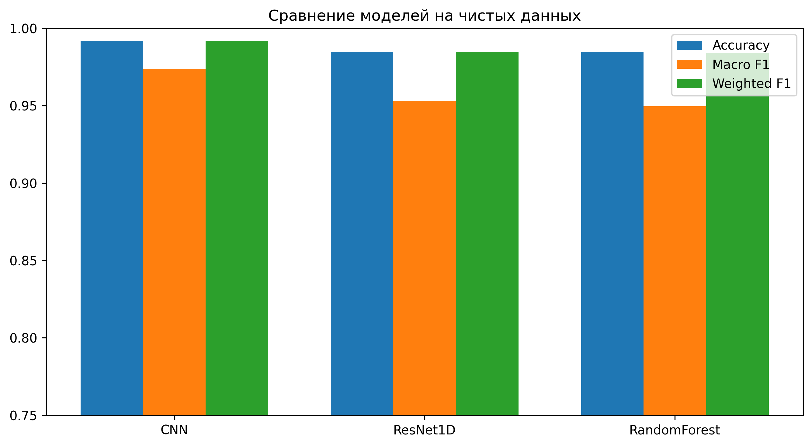

# Классификация аритмий по ЭКГ методами машинного обучения

Курсовая работа (ВМК МГУ, 2026): **«Методы обработки и классификации нестационарных биосигналов с использованием машинного обучения»**.

Автор: Вагапова Деши Насрудиновна

Текст работы: [`thesis/coursework.pdf`](thesis/coursework.pdf) (исходники LaTeX в [`thesis/`](thesis)).

## Задача

Классификация отдельных сердечных сокращений (кардиоциклов) из базы
[MIT-BIH Arrhythmia Database](https://physionet.org/content/mitdb/) по пяти классам:
**N** (норма), **A** (предсердная экстрасистола), **V** (желудочковая экстрасистола),
**L** и **R** (блокады левой и правой ножки пучка Гиса).
Объём выборки — 100 025 кардиоциклов, каждый длиной 240 отсчётов.

Сравниваются модели:
- **Random Forest** на сырых отсчётах и на вейвлет-признаках;
- **1D-CNN**;
- **ResNet1D** (одномерная остаточная сеть).

Отдельно исследуется устойчивость моделей к шумам: гауссову, дрейфу изолинии, сетевой помехе 50 Гц и мышечному шуму.

## Результаты

На чистых данных (отложенная выборка):

| Модель       | Accuracy | Macro F1 | Weighted F1 |
|--------------|----------|----------|-------------|
| CNN          | 0.9917   | 0.9736   | 0.9918      |
| ResNet1D     | 0.9847   | 0.9532   | 0.9848      |
| RandomForest | 0.9848   | 0.9496   | 0.9841      |

Кросс-валидация (5 фолдов):

| Модель       | Accuracy         | Macro F1         |
|--------------|------------------|------------------|
| RandomForest | 0.9852 ± 0.0003  | 0.9517 ± 0.0016  |
| CNN          | 0.9819 ± 0.0078  | 0.9473 ± 0.0199  |
| ResNet1D     | 0.9065 ± 0.0723  | 0.8496 ± 0.0532  |

CNN показывает лучшее качество на чистом сигнале, а Random Forest оказался самым стабильным и наиболее устойчивым к гауссову шуму.
Подробные таблицы лежат в [`reports/`](reports), графики — в [`reports/figures/`](reports/figures).



## Как воспроизвести

```bash
pip install -r requirements.txt

python download_datasets.py        # скачать MIT-BIH в data/raw
python extract_ecg_beats.py        # нарезать кардиоциклы -> data/processed/ecg/beats.csv

python train_random_forest_ecg.py
python train_rf_wavelet.py
python train_cnn_ecg.py
python train_resnet_ecg.py

python evaluate_models.py          # метрики и матрицы ошибок
python cross_validation.py         # кросс-валидация
python noise_experiments.py        # устойчивость к шумам
python generate_report_table.py    # итоговые таблицы
```

## Структура

```
├── src/
│   ├── models/resnet1d.py           # архитектура ResNet1D
│   └── preprocessing/               # вейвлет-признаки, генерация шумов
├── train_*.py                       # обучение моделей
├── evaluate_models.py, cross_validation.py, noise_experiments.py
├── plot_*.py, load_and_plot_ecg.py  # визуализация
├── models/                          # обученные нейросети (*.pt) и скейлеры
├── reports/                         # таблицы результатов и графики
└── thesis/                          # текст курсовой (LaTeX + PDF)
```

Данные (`data/`) и модели Random Forest (~70 МБ) в репозиторий не входят: их можно получить скриптами выше.
